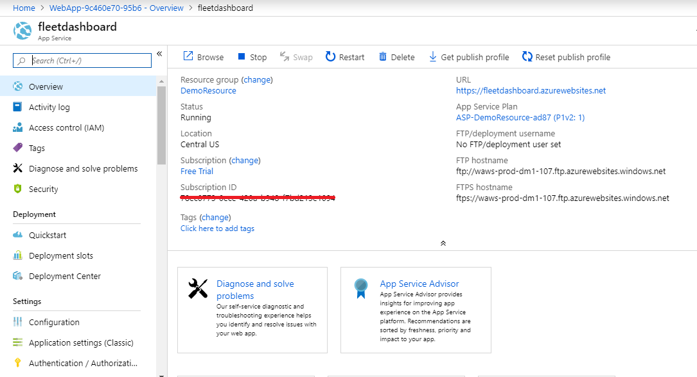

# 3. Data Setup Web App

## Introduction

In this module, you’ll create a dashboard to plot Trucks on the map and watch their status in real-time and you will be able to plot the Line graph dashboard to analyze the various parameters of the Truck in real-time like Engine Temperature, Engine RPM, Engine Load and Coolant Temperature.

## Overview

In this module you will create Azure Web App to plot the dashboard to monitor the trucks in real time. In our previous module we have developed producer, it sends the data to the Azure Cosmos DB. Using this WebApp we will fetch/read the data from the Cosmos DB and we will plot the Map based dashboard and Line Graph dashboard. 

## Implementation

In our previous modules we have created and configured Event hub and Cosmos DB. We assume that you have completed the previous modules successfully. In this module you are going to create a Web App and FTP the dashboard script to fetch the records from the Cosmos DB.
  
## 1. Data Setup for Producer

In this step you will download the script files from the link. In the next step you need to do the required configuration to get connected to Cosmos DB. This script file will plot the dashboard for the Trucks in real time and it will also plot the line graph dashboard for Engine Temperature, Engine RPM, Engine Load & Coolant Temperature details of the Truck.

<strong>Step-by-step instructions (expand for details)</strong>

 
1. Click the [link](https://github.com/iyyappan16/AzureHereMap/blob/master/3_Data_Setup_WebApp/FleetDashboard.zip) and download the zip file (fleetdashboard.zip). 

	
1. Save it in to your local machine.

## 2. Create Azure Web App

In this step you will create an Azure Web App to upload the script files. Then you need to make the required configuration changes to get connected to Azure Cosmos DB.

<strong>Step-by-step instructions (expand for details)</strong>

 
1. Go to **Azure Portal** home page

1. Click **Create a Resource** on the top left. Enter **web app** in the search box to get the required resource type and hit Enter.

	  

1. Select **Web App** from the search results and click **Create** button

	  
	
	
1. It will be asked to provide some basic information for this App:
    1. Project details tab, select your **subscription** and the use the same **resource group** which you used in the previous modules
    
    2. In the Instance details, the first box is the **name** of your app. Use unique and qualified name like **fleetdashboard**.
    
    3. Select **Run-Time Stack** as **Node 8.0** and select **Runtime** as **windows**
    
    4. Leave the other parameters as default

1. Click on **Review & Create**, it will validate the details 

	  
		
1. Click on **Create**, It may take more than a minute for deployment
	
1. After successful deployment, Click on **Go to resource**

	  
	
		
1. In overview tab, find **URL** to access your web-app
		
	
	
	
1. Type **Advanced Tools** in search bar

1. Click on **Advanced Tool** under **Development Tools** section

	
    
  
1. Click on **Go** -> it opens up in the new tab

1. In menu select **Zip Push Deploy** under **Tools**

	
  

1. Browse to the directory where you have saved the downloaded zip file (fleetdashboard.zip) in step-1. 

1. Select the file and “drag and drop” into the “Kudu console” under /wwwroot

	
  
1. It extracts the files automatically, wait until extraction to complete 100% 

	
    
1. Once extraction is completed, then you can able to see all the files and in console you will get the log “Deployment Successful”

  	

1. Now we are going to make configuration changes. You can able to the files has been extracted automatically.

1. Now go to the file **config.js** click the **Edit** icon (pen icon)

	

1. In **config.js** file find the variable **config.endpoint** & **config.primaryKey** and replace the value with **Cosmos DB URI & Cosmos DB PRIMARY KEY** value which you copied in the **module 1**.
  
1. Click on the **Save** button to save the file

	
  
 
1. Click on the **Script** to open the folder in the list

	
  
1. Now go to the file **truck_dashboard.js** click the **Edit** icon (pen icon)

	
 
1. In **truck_dashboard.js** file find the variable **app_id** & **app_code** and replace the value with **HERE APP_ID** & **APP_CODE** value which you copied in the **module 1**.

  	

1. Click on **Save** button to save the file

1. Close the tab and go back to the Azure portal
  
	  

